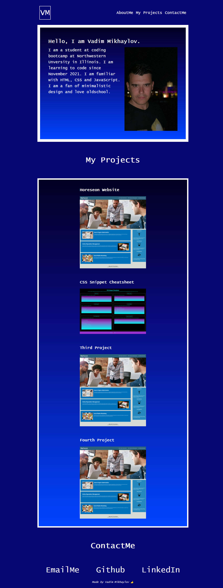

# 02 Advanced CSS: Portfolio

## Description

Personal portfolio page was created using knowledges, skills and experience from Week 1 and 2.

## Screenshots

## Links to Application

- Here is a repo [https://github.com/slowsonic/portfolio]
- Here is a page [https://slowsonic.github.io/portfolio/]
